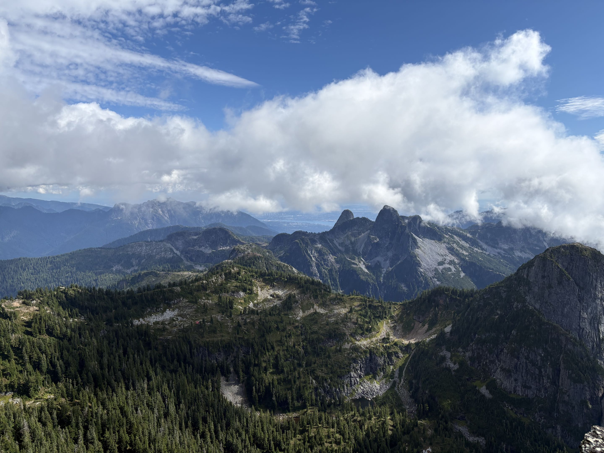

The first few weeks of the Master of Data Science program have gone by pretty quickly. Orientation was a good chance to meet some of my classmates and get a better idea of what the year would look like. It was a little strange going from finishing my Computer Engineering degree to starting another program at UBC so soon after, but it was also exciting to have a fresh start and meet a completely new group of people.

The first week of classes was definitely a bit overwhelming. There was a lot of new material to take in, especially with Python, R, Git, and Quarto all being used together. What surprised me most was how quickly we were expected to start applying these tools rather than just learning them individually. I'm still getting used to the pace, but I'm starting to get a better sense of how everything fits together.

Outside of class, I went on a hike up Mount Brunswick over the weekend. It was a nice break from sitting at my computer and a good way to reset after the first week. I'm still figuring out what my routine will look like during MDS, but so far I'm feeling a mix of excited, challenged, and a little nervous about what's ahead.

